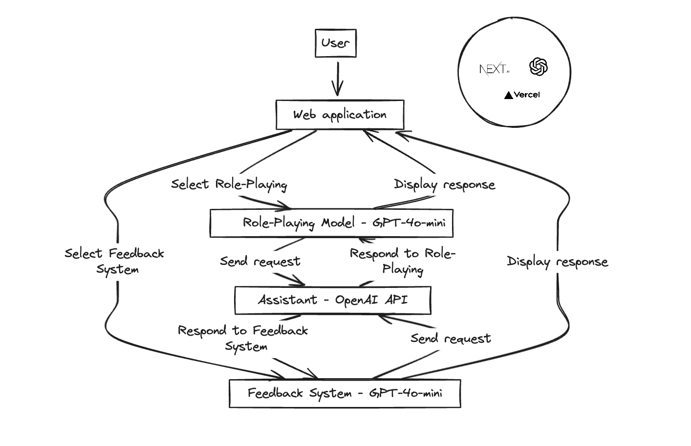

## 알고범죄

경계선 지능인을 위한 범죄 예방 시뮬레이션 서비스

### 아키텍처

### 사용 데이터

#### 참고자료

`뉴스 기사`

- [장애·비장애도 아닌 '경계선 지능인' 범죄피해 우려](https://jnilbo.com/68656546715)
- [경계에 서 있는 700만명의 사람들 [경계선 지능인]](https://www.futurechosun.com/archives/87270)
- [‘경계선 지능’ 대학생 속여 3천여만 원 가로챈 40대 검찰 송치](https://news.kbs.co.kr/news/pc/view/view.do?ncd=3077147)
- ["피해 입어도 가해자로 둔갑" 억울한 경계선 지능인](https://kwnews.co.kr/page/view/2022112816384352526)

`문서 및 데이터`

- [2023년도 장애인정책 청년 모니터링단 활동보고서.pdf](https://www.koddi.or.kr/data/research01.jsp)
- [한국인터넷진흥원 「피싱 메일 공격 사례 분석 및 대응 방안」](https://www.data.go.kr/data/15102026/fileData.do?recommendDataYn=Y)
- [경찰청\_보이스피싱 현황](https://www.data.go.kr/data/15063815/fileData.do)

### 기능 설명
